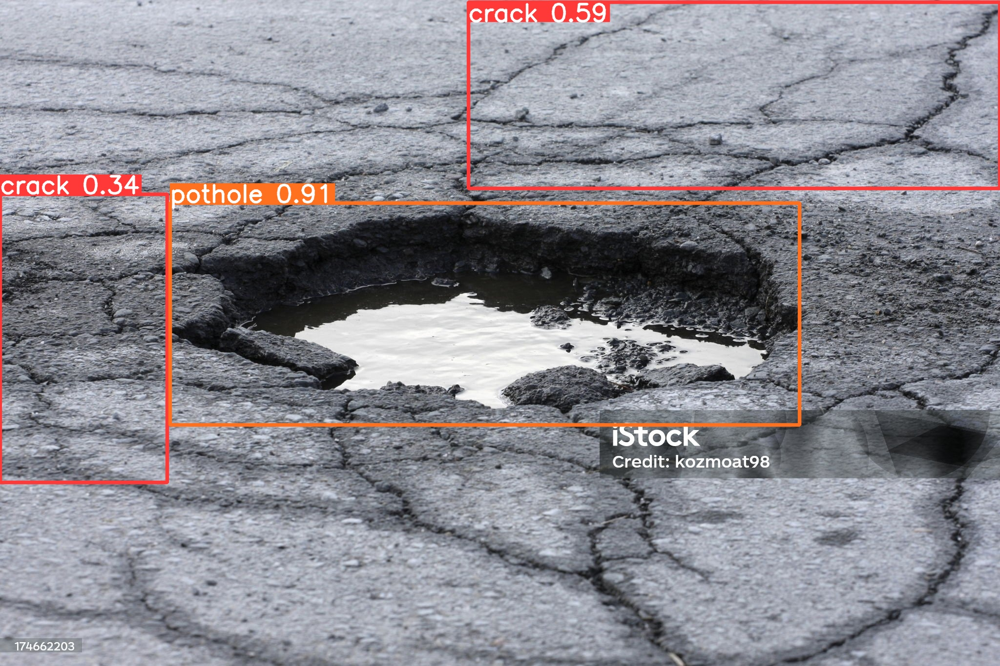

# 🚧 Road Damage Detection using YOLOv8 

## Table of Contents
- [Project Overview](#project-overview)
- [Progress Summary](#progress-summary)
- [Dataset](#dataset)
- [Model](#model)
- [Instalation](#instalation)
- [Deploy](#deploy)
- [Detection Demo](#detection-demo)
- [Next Steps](#next-steps)
- [Author](#author)
- [Lisence](#lisence)

## Project Overview 

This project aims to build a real-time road damage detection system for:
- **Potholes**
- **Cracks**
- **Patched Roads**


## Progress Summary
✅ **Completed** | ⏳ **In Progress** | ❌ **Pending**

| Task                | Status | Details                          |
|---------------------|--------|----------------------------------|
| Dataset Collection  | ✅     | 4000+ images from [click here](https://universe.roboflow.com/jason-workspace-krcmo/pothole-ewv2r/dataset/4)        |
| Annotation          | ✅     | 4000+ images labeled (YOLOv8 PyTorch TXT)  |
| Baseline Model      | ✅     | YOLOv8    |
| Evaluate Model      | ✅     | mAP50:    mAP50-95:  |
| Optimize hyperparameter | ✅ | optimize the pixel size, and get more data, also add more epoch to be 100 | 
| Deploy Model | ✅ | already deploy with fastAPI and html frontend page| 

##  Dataset

📦 **Source**: Combined from multiple public datasets on [Roboflow Universe](https://universe.roboflow.com)  
📐 **Format**: YOLOv8  
📊 **Total Images**: 4188 annotated images  
🔗 **Final Dataset (Merged via Roboflow)**: [Pothole_Detection-hfnqo-xmx8j](https://universe.roboflow.com/jason-workspace-krcmo/pothole_detection-hfnqo-xmx8j)

### 📁 Included Datasets:
| Dataset Name                             | Link                                                                                                             | Total Images |
|-----------------------------------------|------------------------------------------------------------------------------------------------------------------|--------|
| Pothole Detection (Jerry Cooper)        | [🔗 Link](https://universe.roboflow.com/jerry-cooper-tlzkx/pothole_detection-hfnqo/)                             | 1043   |
| Pothole Detection (Vaibhavraje Gaikwad) | [🔗 Link](https://universe.roboflow.com/vaibhavraje-gaikwad/pothole-detection-d0d4l)                             | 48     |
| My Road Crack Dataset                   | [🔗 Link](https://universe.roboflow.com/newroadcrack/my-road-crack-dataset/)                                     | 385    |
| Road Crack Detection Combined           | [🔗 Link](https://universe.roboflow.com/road-crack-project/road-crack-detection-combined-dataset)                | 616    |
| Road Vakow                              | [🔗 Link](https://universe.roboflow.com/road-crack-project/road-vakow/)                                          | 3      |
| Road Pavement Distress Analysis         | [🔗 Link](https://universe.roboflow.com/saquib-s-zsbio/road-pavement-distress-analysis/)                         | 1137   |
| Pavement Distresses                     | [🔗 Link](https://universe.roboflow.com/workspace-pavement/pavement-distresses)                                  | 856    |

### 🧩 Dataset Preparation

All datasets were **imported into a single Roboflow workspace**, where the following steps were done using **Roboflow's Merge Datasets** feature:

1. ✅ Unified all label classes and annotation formats to YOLOv8.
2. ✂️ Removed duplicates and corrupted files.
3. 🧼 Applied label verification and basic filtering.
4. 🔄 Split into `train`, `valid`, and `test` subsets.
5. 📁 Exported as YOLOv8-compatible zipped dataset.

Roboflow’s web interface was used to visually validate labels and generate the final merged dataset, making it ready for model training.

📂 **Directory Preview (after export)**:
---
```bash
dataset/
├── train/
│   ├── images/
│   └── labels/
├── valid/
├── test/
└── data.yaml
```

---


##  Model
### 🖥️ Pipeline
- **Python**

### ⚙️ Framework
- **YOLOv8** (Ultralytics)

### 🧪 Training Details
- Epochs: 100
- Image Size: 640x640
- Device: GTX 1650 (4GB)
- Classes: `crack`, `pothole`, `patch`

### 📈 Results (Latest mAP)

| Class      | mAP@50 | mAP@50–95 |
|------------|--------|-----------|
| All        | 0.635  | 0.382     |
| Crack      | 0.452  | 0.207     |
| Patch      | 0.709  | 0.477     |
| Pothole    | 0.744  | 0.463     |

---

##  Installation

### ⚙️ Requirements
- Python ≥ 3.10.14
- PyTorch ≥ 2.0.1+cu117
- Ultralytics
- roboflow
- using GPU Nvidia GTX with 11.7

### 🔧 Setup
```bash
# Clone this repo
git clone 
cd pothole_detection-3

# Train
yolo detect train data=dataset/data.yaml model=yolov8s.pt imgsz=640 epochs=100
```

---
### 🛠️ Inference Example

```bash
yolo detect predict model=runs/detect/train/weights/best.pt source=your_video.mp4
```

---

## Deploy 
The model deployed with This FastAPI application allows you to upload or link images and videos for road damage detection using a trained YOLOv8 model.

#### Endpoints
- `POST /predict/image`: Upload image file
- `POST /predict/image/url`: Provide image URL
- `POST /predict/video`: Upload video file
- `POST /predict/video/url`: Provide video URL

#### Setup Instructions
1. Clone this repo
2. Put your `best.pt` model file in the root folder
3. Build the Docker image:
   ```bash
   docker build -t yolov8-fastapi:latest .
   ```
4. Run the container (for development):
   ```bash
   docker run --gpus all -it --rm -p 8000:8000 yolov8-fastapi
   ```
5.Run the container (for deployment):
   ```bash
   docker run --gpus all -d --name yolov8-app -p 8000:8000 yolov8-fastapi
   ```

#### Example Test
Use `curl` or Postman:
```bash
curl -X POST "http://localhost:8000/predict/image/url" \
  -H "Content-Type: application/json" \
  -d '{"url": "https://example.com/image.jpg"}' --output url to access the result.png
```

##  Detection Demo
### 🖼️ Image Prediction Demo

### 🎞️Video Prediction Demo


##  Next Steps

✅ Data collection and annotation  
✅ Train YOLOv8 with OBB  
✅ Evaluate mAP  
✅ Optimize with hyperparameter tuning  
✅ Deploy to web

##  Author

Jason Patrick  
Computer Vision – Politeknik Caltex Riau

---

##  License

This project is licensed under the MIT License. See `LICENSE` for details.
